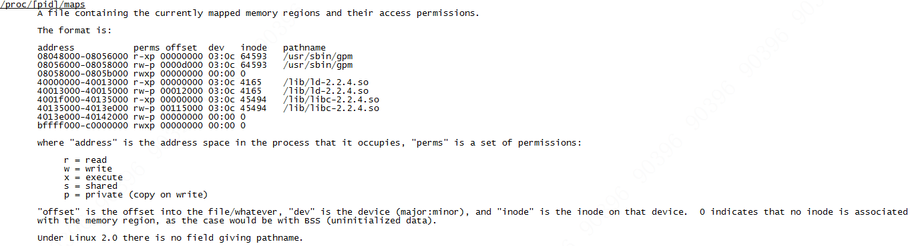

There are two common kinds of SEGV, which is an error that results from an invalid memory access:
+ A page was accessed which had the wrong permissions. E.g., it was read-only but your code tried to write to it. This will be reported as SEGV_ACCERR.
+ A page was accessed that is not even mapped into the address space of the application at all. This will often result from dereferencing a null pointer or a pointer that was corrupted with a small integer value. This is reported as SEGV_MAPERR.

有两种类型的SEGV，当进行无效内存访问会产生该错误。
+ 对没有权限的页进行访问。如，该内存为只读的而代码尝试写入，会报SEGV_ACCERR 错误。nvalid permissions for mapped object
+ 访问了没有被映射到寻址空间的页时，报SEGV_MAPERR 错误，常在解引用空指针或指针被小整型值破坏时发生。address not mapped to object 

https://www.oracle.com/technetwork/java/javase/crashes-137240.html  
-Xcheck:jni

-XX:NativeMemoryTracking=detail
jcmd pid VM.native_memory detail

-XX:OnError="gdb - %p"

/proc/[pid]/maps  
包含了当前映射的内存区域和它们的访问权限。
 A file containing the currently mapped memory regions and their access permissions.

              The format is:

              address           perms offset  dev   inode   pathname
              08048000-08056000 r-xp 00000000 03:0c 64593   /usr/sbin/gpm
              08056000-08058000 rw-p 0000d000 03:0c 64593   /usr/sbin/gpm
              08058000-0805b000 rwxp 00000000 00:00 0
              40000000-40013000 r-xp 00000000 03:0c 4165    /lib/ld-2.2.4.so
              40013000-40015000 rw-p 00012000 03:0c 4165    /lib/ld-2.2.4.so
              4001f000-40135000 r-xp 00000000 03:0c 45494   /lib/libc-2.2.4.so
              40135000-4013e000 rw-p 00115000 03:0c 45494   /lib/libc-2.2.4.so
              4013e000-40142000 rw-p 00000000 00:00 0
              bffff000-c0000000 rwxp 00000000 00:00 0

              地址为当前进程占用的寻址空间，"perms" 为 permissions 访问权限，r=read、w=write、x=execute、s=shared、
              p=private (copy on write) 写时复制
              where "address" is the address space in the process that it occupies, "perms" is a set of permissions:

                   r = read
                   w = write
                   x = execute
                   s = shared
                   p = private (copy on write)

              "offset" 为进入文件或其他的偏移，"dev" 为设备(major:minor)，"inode" 为设备上节点，0表示没有inode 关联。
              "offset" is the offset into the file/whatever, "dev" is the device (major:minor), and "inode" is the inode on that device.  
              0 indicates that no inode is associated
              with the memory region, as the case would be with BSS (uninitialized data).

              Under Linux 2.0 there is no field giving pathname.

